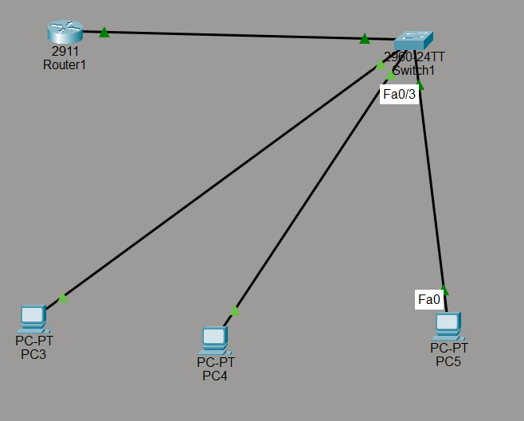
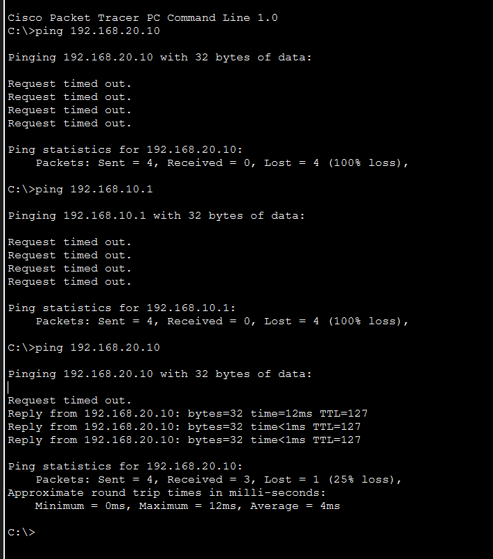
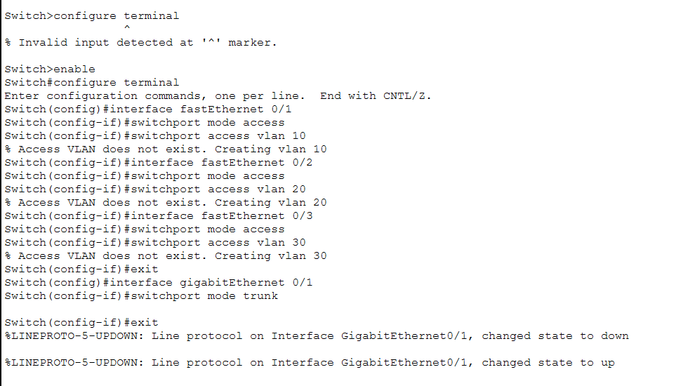

# Enterprise LAN - Inter-VLAN Routing & Segmentation

A professional enterprise networking project implemented in **Cisco Packet Tracer**, demonstrating core networking concepts including VLAN segmentation, 802.1Q trunking, and Router-on-a-Stick routing.

---

## 🚀 Project Architecture & Topology
* **Network Devices:** 1x Cisco 2911 Router, 1x Cisco 2960 Switch, 3x End-User PCs (PC3, PC4, PC5).
* **VLAN Segmentation:**
  * **VLAN 10:** Engineering / Management (`192.168.10.0/24`)
  * **VLAN 20:** Sales / Operations (`192.168.20.0/24`)
  * **VLAN 30:** HR / Administration (`192.168.30.0/24`)

---

## 🛠️ Technical Implementation & Configuration
1. **Switch Configuration:** Created VLANs 10, 20, and 30. Configured access ports connected to end devices and established a trunk port (`802.1Q`) linking the switch to the router.
2. **Router-on-a-Stick:** Configured sub-interfaces on the router (`GigabitEthernet0/0.10`, `0/0.20`, `0/0.30`) utilizing IEEE 802.1Q encapsulation to route traffic between isolated VLAN subnets.
3. **End-Device Provisioning:** Assigned static IPv4 addresses, subnet masks, and default gateways matching respective VLAN sub-interfaces.

---

## 📸 Project Screenshots & Verification

### Network Topology

### Inter-VLAN Routing Ping Test

### Switch CLI Configuration

